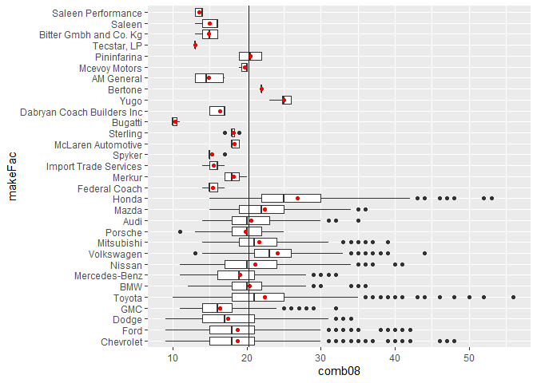
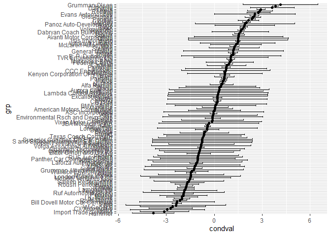
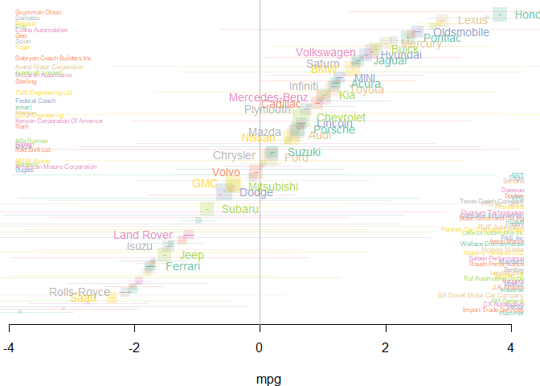

A data description is available at
<a href="https://www.fueleconomy.gov/feg/ws/index.shtml#vehicle.\" class="uri">https://www.fueleconomy.gov/feg/ws/index.shtml#vehicle.\</a>  

    cUrl =  'https://www.fueleconomy.gov/feg/epadata/vehicles.csv.zip'
    cFile = file.path(tempdir(), basename(cUrl))
    download.file(cUrl, cFile)
    cFile2 = unzip(cFile, exdir=tempdir())
    x = read.table(cFile2, sep=',', header=TRUE, stringsAsFactors=FALSE)

  

    # have a look
    head(x)

    ##   barrels08 barrelsA08 charge120 charge240 city08 city08U cityA08 cityA08U
    ## 1  15.69571          0         0         0     19       0       0        0
    ## 2  29.96455          0         0         0      9       0       0        0
    ## 3  12.20778          0         0         0     23       0       0        0
    ## 4  29.96455          0         0         0     10       0       0        0
    ## 5  17.34789          0         0         0     17       0       0        0
    ## 6  14.98227          0         0         0     21       0       0        0
    ##   cityCD cityE cityUF co2 co2A co2TailpipeAGpm co2TailpipeGpm comb08 comb08U
    ## 1      0     0      0  -1   -1               0       423.1905     21       0
    ## 2      0     0      0  -1   -1               0       807.9091     11       0
    ## 3      0     0      0  -1   -1               0       329.1481     27       0
    ## 4      0     0      0  -1   -1               0       807.9091     11       0
    ## 5      0     0      0  -1   -1               0       467.7368     19       0
    ## 6      0     0      0  -1   -1               0       403.9545     22       0
    ##   combA08 combA08U combE combinedCD combinedUF cylinders displ
    ## 1       0        0     0          0          0         4   2.0
    ## 2       0        0     0          0          0        12   4.9
    ## 3       0        0     0          0          0         4   2.2
    ## 4       0        0     0          0          0         8   5.2
    ## 5       0        0     0          0          0         4   2.2
    ## 6       0        0     0          0          0         4   1.8
    ##                        drive engId   eng_dscr feScore fuelCost08 fuelCostA08
    ## 1           Rear-Wheel Drive  9011      (FFS)      -1       1600           0
    ## 2           Rear-Wheel Drive 22020  (GUZZLER)      -1       3050           0
    ## 3          Front-Wheel Drive  2100      (FFS)      -1       1250           0
    ## 4           Rear-Wheel Drive  2850                 -1       3050           0
    ## 5 4-Wheel or All-Wheel Drive 66031 (FFS,TRBO)      -1       2300           0
    ## 6          Front-Wheel Drive 66020      (FFS)      -1       1550           0
    ##   fuelType        fuelType1 ghgScore ghgScoreA highway08 highway08U highwayA08
    ## 1  Regular Regular Gasoline       -1        -1        25          0          0
    ## 2  Regular Regular Gasoline       -1        -1        14          0          0
    ## 3  Regular Regular Gasoline       -1        -1        33          0          0
    ## 4  Regular Regular Gasoline       -1        -1        12          0          0
    ## 5  Premium Premium Gasoline       -1        -1        23          0          0
    ## 6  Regular Regular Gasoline       -1        -1        24          0          0
    ##   highwayA08U highwayCD highwayE highwayUF hlv hpv    id lv2 lv4       make
    ## 1           0         0        0         0   0   0     1   0   0 Alfa Romeo
    ## 2           0         0        0         0   0   0    10   0   0    Ferrari
    ## 3           0         0        0         0  19  77   100   0   0      Dodge
    ## 4           0         0        0         0   0   0  1000   0   0      Dodge
    ## 5           0         0        0         0   0   0 10000   0  14     Subaru
    ## 6           0         0        0         0   0   0 10001   0  15     Subaru
    ##                 model mpgData phevBlended pv2 pv4 range rangeCity rangeCityA
    ## 1  Spider Veloce 2000       Y       false   0   0     0         0          0
    ## 2          Testarossa       N       false   0   0     0         0          0
    ## 3             Charger       Y       false   0   0     0         0          0
    ## 4 B150/B250 Wagon 2WD       N       false   0   0     0         0          0
    ## 5    Legacy AWD Turbo       N       false   0  90     0         0          0
    ## 6              Loyale       N       false   0  88     0         0          0
    ##   rangeHwy rangeHwyA           trany   UCity UCityA UHighway UHighwayA
    ## 1        0         0    Manual 5-spd 23.3333      0  35.0000         0
    ## 2        0         0    Manual 5-spd 11.0000      0  19.0000         0
    ## 3        0         0    Manual 5-spd 29.0000      0  47.0000         0
    ## 4        0         0 Automatic 3-spd 12.2222      0  16.6667         0
    ## 5        0         0    Manual 5-spd 21.0000      0  32.0000         0
    ## 6        0         0 Automatic 3-spd 27.0000      0  33.0000         0
    ##            VClass year youSaveSpend guzzler trans_dscr tCharger sCharger
    ## 1     Two Seaters 1985        -1750                          NA         
    ## 2     Two Seaters 1985        -9000       T                  NA         
    ## 3 Subcompact Cars 1985            0                SIL       NA         
    ## 4            Vans 1985        -9000                          NA         
    ## 5    Compact Cars 1993        -5250                        TRUE         
    ## 6    Compact Cars 1993        -1500                          NA         
    ##   atvType fuelType2 rangeA evMotor mfrCode c240Dscr charge240b c240bDscr
    ## 1                                                            0          
    ## 2                                                            0          
    ## 3                                                            0          
    ## 4                                                            0          
    ## 5                                                            0          
    ## 6                                                            0          
    ##                      createdOn                   modifiedOn startStop phevCity
    ## 1 Tue Jan 01 00:00:00 EST 2013 Tue Jan 01 00:00:00 EST 2013                  0
    ## 2 Tue Jan 01 00:00:00 EST 2013 Tue Jan 01 00:00:00 EST 2013                  0
    ## 3 Tue Jan 01 00:00:00 EST 2013 Tue Jan 01 00:00:00 EST 2013                  0
    ## 4 Tue Jan 01 00:00:00 EST 2013 Tue Jan 01 00:00:00 EST 2013                  0
    ## 5 Tue Jan 01 00:00:00 EST 2013 Tue Jan 01 00:00:00 EST 2013                  0
    ## 6 Tue Jan 01 00:00:00 EST 2013 Tue Jan 01 00:00:00 EST 2013                  0
    ##   phevHwy phevComb
    ## 1       0        0
    ## 2       0        0
    ## 3       0        0
    ## 4       0        0
    ## 5       0        0
    ## 6       0        0

    # Restrict to non-electric vehicles, since electic vehicles are hard to compare with.
    xSub = x[grep("Electricity|CNG", x$fuelType, invert=TRUE), ]
    # Create a decade variable, centerd on 2000
    xSub$decade = (xSub$year - 2000)/10
    # Create a table of the car makes, in order form most to least cars in the dataset
    makeTable = sort(table(xSub$make), decreasing=TRUE)
    # Use the table above, to make a factor that returns unique car makes.
    xSub$makeFac = factor(xSub$make, levels=names(makeTable))
    # Make a factor for the number of cylinders, (return unique values for cylinders),
    # and make 4-cylinders vehicle the reference group.
    xSub$cylFac = relevel(factor(xSub$cylinders), '4')
    # Check this worked
    levels(xSub$cylFac)

    ## [1] "4"  "2"  "3"  "5"  "6"  "8"  "10" "12" "16"

    # Get rid of vehicles with missing cylinder number
    xSub = xSub[!is.na(xSub$cylFac), ]
    # Make the transmission variable nicer, use grepl function to search the pattern:
    xSub$transmission = factor(
      grepl("Manual", xSub$trany), levels=c(FALSE,TRUE),
        labels = c('Automatic', 'Manual'))
    # Make a variable indicating if the vehicle had four-wheel drive
    xSub$FWD = grepl("([[:punct:]]|[[:space:]])+4(WD|wd)",  xSub$VClass)
    # Make a new, simpler vehicle type variable
    xSub$type = gsub("Vans.*", "Vans",  xSub$VClass)
    xSub$type = gsub("Vehicles", "Vehicle", xSub$type)
    xSub$type = gsub("Standard[[:space:]]+", "", xSub$type)
    xSub$type = factor(gsub("([[:punct:]]|[[:space:]])+(2|4)(WD|wd)", "",  xSub$type))

  
We are interested in some variables:  
**comb08**: A measure of fuel use across highway and city driving;  
**decade**: Which year the car was made in, centered on 2000;  
**transmission**: Indicating whether the vehicles are manual or
automatic;  
**makeFac**: The make of the cars;  
**cylFac**: Number of cylinders;  
**type**: The type of the cars;  
**FWD**: Indicating whether the car is four-wheel drive or not.  
  
After selecting the variables, we get the final dataset:

    # final dataset
    car_final <- xSub %>% 
      select(comb08, decade, transmission, makeFac, cylFac, type, FWD)

As it shown in the above table, there are 41696 observations, 1
numerical response variable, and 6 covariates (5 categorical).  
  

    lm = lm(comb08 ~., data = car_final)
    # summary(lm)

However, I have concerned about the independence assumption for linear
regression, because there are several car makers producing multiple
vehicle types, which means, for example, the Audi Branch produces A3,
A4, A5, A7, etc., and their fuel efficiencies are somehow related.  
  
I would like to visualize fuel efficiency by make:

    # Using tidyverse
    car_final %>% 
      mutate(grand_mean = mean(comb08)) %>% 
      group_by(makeFac) %>% 
      mutate(n_make = n()) %>% 
      filter(n_make >= 1000 | n_make %in% (5:15)) %>% 
      mutate(mean = mean(comb08)) %>% 
      ggplot(aes(x = makeFac, y = comb08)) +
      geom_boxplot() +
      geom_point(aes(y=mean), color = "red") +
      geom_hline(aes(yintercept = grand_mean), color = "blue") +
      coord_flip()

It is reasonable to conclude that there are correlations between
different types under the same make. Thus, we should fit a linear mixed
model.  
  
Fitting a LMM:

    lmm_make <- lme4::lmer(comb08 ~ cylFac + 
                      decade + transmission + 
                      (1|makeFac),
                    data=car_final)
    summary(lmm_make)

    ## Linear mixed model fit by REML ['lmerMod']
    ## Formula: comb08 ~ cylFac + decade + transmission + (1 | makeFac)
    ##    Data: car_final
    ## 
    ## REML criterion at convergence: 211520.2
    ## 
    ## Scaled residuals: 
    ##     Min      1Q  Median      3Q     Max 
    ## -3.8265 -0.5974 -0.0690  0.4716 10.1621 
    ## 
    ## Random effects:
    ##  Groups   Name        Variance Std.Dev.
    ##  makeFac  (Intercept) 3.309    1.819   
    ##  Residual             9.267    3.044   
    ## Number of obs: 41696, groups:  makeFac, 131
    ## 
    ## Fixed effects:
    ##                     Estimate Std. Error  t value
    ## (Intercept)         23.33633    0.19094  122.215
    ## cylFac2             -5.85372    0.43751  -13.380
    ## cylFac3              9.76204    0.19487   50.094
    ## cylFac5             -3.75740    0.12858  -29.222
    ## cylFac6             -5.60304    0.03920 -142.929
    ## cylFac8             -8.53289    0.04868 -175.287
    ## cylFac10           -10.25253    0.26085  -39.304
    ## cylFac12           -10.32568    0.15495  -66.639
    ## cylFac16           -14.66164    2.04650   -7.164
    ## decade               1.20400    0.01538   78.307
    ## transmissionManual   0.50049    0.03537   14.149
    ## 
    ## Correlation of Fixed Effects:
    ##             (Intr) cylFc2 cylFc3 cylFc5 cylFc6 cylFc8 cylF10 cylF12 cylF16
    ## cylFac2     -0.004                                                        
    ## cylFac3     -0.023  0.001                                                 
    ## cylFac5     -0.027  0.004  0.009                                          
    ## cylFac6     -0.109  0.026  0.046  0.128                                   
    ## cylFac8     -0.120  0.013  0.039  0.112  0.516                            
    ## cylFac10    -0.031  0.001  0.006  0.031  0.088  0.091                     
    ## cylFac12    -0.070  0.004  0.012  0.039  0.168  0.229  0.153              
    ## cylFac16    -0.093  0.000  0.002  0.002  0.010  0.011  0.003  0.007       
    ## decade      -0.015  0.024 -0.006  0.014  0.011  0.030 -0.038 -0.013 -0.009
    ## trnsmssnMnl -0.087  0.000 -0.014  0.005  0.150  0.183 -0.005  0.044  0.006
    ##             decade
    ## cylFac2           
    ## cylFac3           
    ## cylFac5           
    ## cylFac6           
    ## cylFac8           
    ## cylFac10          
    ## cylFac12          
    ## cylFac16          
    ## decade            
    ## trnsmssnMnl  0.252

**makeFac** has a variance (*σ*2) under random effects with a
value of 3.308, that is the random itercept, meaning the variance
between groups. Residual has a variance of 9.238, and that is
represented by *τ*2.  

*σ*2/(*σ*2 + *τ*2) = 0.17

  
That means, the import of the random intercept helps us explain 17
percent more of the variance, which is good.  
  
Exploring the intercepts for each make:

    my_random_effects <- lme4::ranef(lmm_make, condVar=TRUE)

    ranef_df <- as.data.frame(my_random_effects)
    # ggplot
    ranef_df %>% 
      ggplot(aes(x = grp, y = condval, ymin = condval - 2*condsd, ymax = condval + 2*condsd)) +
      geom_point() +
      geom_errorbar() +
      coord_flip()

The black solid points in the diagram above represent the relative
estimated values of each car makes. And the lines represent the
confidence intervals respectively. And we see there are some
non-overlapped CIs, meaning there exist at least two random intercepts
are not equal. Thus, import random effect is helpful.  
  
Fuel efficiency of auto manufacturers adjusted for engine type:

    x = data.frame(
        make = rownames(my_random_effects$makeFac),
        est = my_random_effects$makeFac[[1]],
        se = drop(attributes(my_random_effects$makeFac)$postVar),
        stringsAsFactors = FALSE
        )
    x$lower = x$est - 2*x$se
    x$upper = x$est + 2*x$se
    x = x[x$se < 2, ]
    x = x[order(x$est), ]

    x$index = rank(x$est)
    x$accurate = rank(x$se) < 40

    x$col= rep_len(RColorBrewer::brewer.pal(8, 'Set2'), nrow(x))
    x$colTrans = paste0(x$col, '40')
    x$colLine = x$col
    x[!x$accurate,'colLine'] = x[!x$accurate,'colTrans']

    x$cex = -log(x$se) 
    x$cex = x$cex - min(x$cex)
    x$cex = 3*x$cex / max(x$cex)

    x$textpos = rep_len(c(4,2), nrow(x))
    x[!x$accurate & x$est > 0, 'textpos'] = 4
    x[!x$accurate & x$est < 0, 'textpos'] = 2

    x$textloc = x$est

    x$textCex = c(0.5, 0.9)[1+x$accurate]

    par(mar=c(4,0,0,0), bty='n')
    plot(x$est, x$index, yaxt='n', xlim = range(x$est),
        #xlim = range(x[,c('lower','upper')]),
        xlab='mpg', ylab='', pch=15, col=x$colTrans , cex=x$cex)

    x[!x$accurate & x$est > 0, 'textloc'] = par('usr')[1]
    x[!x$accurate & x$est < 0, 'textloc'] = par('usr')[2]

    abline(v=0, col='grey')
    segments(x$lower, x$index, x$upper, x$index, pch=15, col=x$colLine)
    text(
        x$textloc, 
        x$index, x$make,
        pos = x$textpos,
        col=x$col,
        cex=x$textCex, offset=1)

Looking at the complex diagram above, it is reasonable to conclude that
the tendency follows a “S” shape, and that is confirming the random
intercept is useful.  
  
After exploring the diagrams, we are going to focus on whether the
covariates are useful.  
RUN a linear mixed model, adding number of cylinders, vehichle type and
FWD:

    lmm_make_2 = lme4::lmer(comb08~cylFac+type+FWD+decade+transmission+
                              (1|makeFac),
                            data = car_final)
    summary(lmm_make_2)

    ## Linear mixed model fit by REML ['lmerMod']
    ## Formula: comb08 ~ cylFac + type + FWD + decade + transmission + (1 | makeFac)
    ##    Data: car_final
    ## 
    ## REML criterion at convergence: 201917.9
    ## 
    ## Scaled residuals: 
    ##     Min      1Q  Median      3Q     Max 
    ## -4.1889 -0.5504 -0.0780  0.4029 11.2511 
    ## 
    ## Random effects:
    ##  Groups   Name        Variance Std.Dev.
    ##  makeFac  (Intercept) 4.697    2.167   
    ##  Residual             7.344    2.710   
    ## Number of obs: 41696, groups:  makeFac, 131
    ## 
    ## Fixed effects:
    ##                                   Estimate Std. Error  t value
    ## (Intercept)                       23.95248    0.21904  109.351
    ## cylFac2                           -6.58228    0.39214  -16.785
    ## cylFac3                            9.00647    0.17465   51.568
    ## cylFac5                           -3.32517    0.11513  -28.881
    ## cylFac6                           -4.59250    0.03766 -121.959
    ## cylFac8                           -7.15546    0.04816 -148.580
    ## cylFac10                          -9.52939    0.23490  -40.568
    ## cylFac12                          -9.38863    0.14046  -66.844
    ## cylFac16                         -14.39946    2.32716   -6.188
    ## typeLarge Cars                    -0.28464    0.07374   -3.860
    ## typeMidsize-Large Station Wagons  -1.14130    0.11562   -9.871
    ## typeMidsize Cars                  -0.06543    0.05445   -1.202
    ## typeMidsize Station Wagons        -0.94951    0.12266   -7.741
    ## typeMinicompact Cars              -0.61860    0.09907   -6.244
    ## typeMinivan                       -2.82684    0.14281  -19.794
    ## typePickup Trucks                 -4.09769    0.06607  -62.020
    ## typeSmall Pickup Trucks           -3.64610    0.08963  -40.678
    ## typeSmall Sport Utility Vehicle   -1.80693    0.08671  -20.838
    ## typeSmall Station Wagons          -0.13102    0.07721   -1.697
    ## typeSpecial Purpose Vehicle       -3.95294    0.07276  -54.325
    ## typeSport Utility Vehicle         -3.35597    0.06611  -50.764
    ## typeSubcompact Cars               -0.22335    0.05348   -4.176
    ## typeTwo Seaters                   -0.87445    0.07916  -11.046
    ## typeVans                          -4.72373    0.08244  -57.298
    ## FWDTRUE                           -0.65468    0.05114  -12.801
    ## decade                             1.20108    0.01515   79.286
    ## transmissionManual                 0.39689    0.03229   12.291

    ## 
    ## Correlation matrix not shown by default, as p = 27 > 12.
    ## Use print(x, correlation=TRUE)  or
    ##     vcov(x)        if you need it

To find which model is better, we will conduct a likelihood ratio test:

    lmtest::lrtest(lmm_make_2, lmm_make)

    ## Likelihood ratio test
    ## 
    ## Model 1: comb08 ~ cylFac + type + FWD + decade + transmission + (1 | makeFac)
    ## Model 2: comb08 ~ cylFac + decade + transmission + (1 | makeFac)
    ##   #Df  LogLik  Df  Chisq Pr(>Chisq)    
    ## 1  29 -100959                          
    ## 2  13 -105760 -16 9602.4  < 2.2e-16 ***
    ## ---
    ## Signif. codes:  0 '***' 0.001 '**' 0.01 '*' 0.05 '.' 0.1 ' ' 1

The p-value is significant, therefore we prefer model 1
(lmm\_make\_2).  
  
Fit LMM with random slope:

    lmm_make_3 = lme4::lmer(comb08 ~ cylFac+type+FWD+decade+transmission+
                              (1+decade|makeFac),
                            data=car_final)
    summary(lmm_make_3)

    ## Linear mixed model fit by REML ['lmerMod']
    ## Formula: comb08 ~ cylFac + type + FWD + decade + transmission + (1 + decade |  
    ##     makeFac)
    ##    Data: car_final
    ## 
    ## REML criterion at convergence: 199630.6
    ## 
    ## Scaled residuals: 
    ##     Min      1Q  Median      3Q     Max 
    ## -3.7250 -0.5505 -0.0766  0.4038 11.2361 
    ## 
    ## Random effects:
    ##  Groups   Name        Variance Std.Dev. Corr 
    ##  makeFac  (Intercept) 4.178    2.044         
    ##           decade      1.203    1.097    -0.57
    ##  Residual             6.917    2.630         
    ## Number of obs: 41696, groups:  makeFac, 131
    ## 
    ## Fixed effects:
    ##                                   Estimate Std. Error  t value
    ## (Intercept)                       24.04284    0.21397  112.365
    ## cylFac2                           -6.41107    0.38577  -16.619
    ## cylFac3                            8.98798    0.17407   51.635
    ## cylFac5                           -3.08378    0.11709  -26.336
    ## cylFac6                           -4.62256    0.03724 -124.127
    ## cylFac8                           -7.21302    0.04763 -151.437
    ## cylFac10                          -9.85266    0.23087  -42.676
    ## cylFac12                          -9.93300    0.14605  -68.012
    ## cylFac16                         -14.45010    1.88543   -7.664
    ## typeLarge Cars                    -0.48269    0.07257   -6.651
    ## typeMidsize-Large Station Wagons  -1.13714    0.11383   -9.990
    ## typeMidsize Cars                  -0.07893    0.05337   -1.479
    ## typeMidsize Station Wagons        -1.02986    0.11947   -8.620
    ## typeMinicompact Cars              -0.66892    0.09872   -6.776
    ## typeMinivan                       -2.93523    0.13958  -21.029
    ## typePickup Trucks                 -4.23390    0.06515  -64.991
    ## typeSmall Pickup Trucks           -3.75667    0.08804  -42.670
    ## typeSmall Sport Utility Vehicle   -2.01166    0.08658  -23.234
    ## typeSmall Station Wagons          -0.18509    0.07542   -2.454
    ## typeSpecial Purpose Vehicle       -4.21026    0.07327  -57.465
    ## typeSport Utility Vehicle         -3.25845    0.06471  -50.355
    ## typeSubcompact Cars               -0.17960    0.05283   -3.400
    ## typeTwo Seaters                   -0.86697    0.07780  -11.144
    ## typeVans                          -4.88643    0.08105  -60.290
    ## FWDTRUE                           -0.61805    0.04988  -12.392
    ## decade                             1.18271    0.12739    9.285
    ## transmissionManual                 0.39154    0.03155   12.410

    ## 
    ## Correlation matrix not shown by default, as p = 27 > 12.
    ## Use print(x, correlation=TRUE)  or
    ##     vcov(x)        if you need it

Conduct another LRT to compare the random slope:

    lmtest::lrtest(lmm_make_2, lmm_make_3)

    ## Likelihood ratio test
    ## 
    ## Model 1: comb08 ~ cylFac + type + FWD + decade + transmission + (1 | makeFac)
    ## Model 2: comb08 ~ cylFac + type + FWD + decade + transmission + (1 + decade | 
    ##     makeFac)
    ##   #Df  LogLik Df  Chisq Pr(>Chisq)    
    ## 1  29 -100959                         
    ## 2  31  -99815  2 2287.2  < 2.2e-16 ***
    ## ---
    ## Signif. codes:  0 '***' 0.001 '**' 0.01 '*' 0.05 '.' 0.1 ' ' 1

the p-value is significant, therefore we say the random slope “decade”
is needed.  
  
**However**, the problem here is the p-value is always significant,
because the sample size is too big. This is due to the test being on a
boundary condition (*σ*2 &gt; 0). To fix that, we need to
reduce the sample size.  

    # restrict the data to just car make with more than 800 vehicles
    car_800 <- car_final %>%
      mutate(grand_mean = mean(comb08)) %>%
      group_by(makeFac) %>%
      mutate(n_make = n()) %>%
      filter(n_make >= 800)
    # re-fit model with new dataset
    lmm_make_reduced1 = lme4::lmer(comb08~cylFac+type+FWD+decade+transmission+(1|makeFac), data = car_800)
    # re-fit model with new dataset random slope
    lmm_make_reduced2 = lme4::lmer(comb08~cylFac+type+FWD+decade+transmission+(1+decade|makeFac), data = car_800)
    # redo LRT
    lmtest::lrtest(lmm_make_reduced1, lmm_make_reduced2)

    ## Likelihood ratio test
    ## 
    ## Model 1: comb08 ~ cylFac + type + FWD + decade + transmission + (1 | makeFac)
    ## Model 2: comb08 ~ cylFac + type + FWD + decade + transmission + (1 + decade | 
    ##     makeFac)
    ##   #Df LogLik Df Chisq Pr(>Chisq)    
    ## 1  28 -71791                        
    ## 2  30 -71275  2  1032  < 2.2e-16 ***
    ## ---
    ## Signif. codes:  0 '***' 0.001 '**' 0.01 '*' 0.05 '.' 0.1 ' ' 1

The p-value is still significant, we should include the random slope,
meaning that there are significant differences between the slopes of
each car make.  
  
Check the slopes by graphing:

    car_800 %>%
      ggplot(aes(x=decade, y=comb08))+
      geom_point(alpha=0.1)+
      geom_smooth(method = "lm")+
      facet_wrap(~makeFac)

    ## `geom_smooth()` using formula 'y ~ x'

This diagram is sort of surprising. It seems the slopes among different
makes are similar.  
This is one of the issue with LRT, for very large datasets, we wil often
see a significant p-value, we’d hesitate to claim it looks like we need
different slopes when eyeballing that data.  
  
Use car\_final data again!  
We are intending to check whether the response value needs a link
function.  

    # hist of response
    hist(car_final$comb08)

As we can see, this is not normal.  
Double check the result with ggplot,

    # ggplot
    car_final %>%
      ggplot(aes(x=comb08))+
      geom_histogram(fill="darkgrey", color="black", bins=60)

Indeed, it is a right-skewed gamma (since continuous) distribution
instead of normal. We should use link function log.  
The distribution is centered at 20, the mean will be higher than the
median due to the right-skew. The highest value is almost 60.  
We are concerned about fitting just Linear Mixed Model.  
Fit a generalized linear mixed model:

    glmm_make = lme4::glmer(comb08 ~ cylFac+transmission+decade+(1|makeFac),
                            family=Gamma(link=log),
                            data=xSub[xSub$year < 2000, ])

    ## Warning in checkConv(attr(opt, "derivs"), opt$par, ctrl = control$checkConv, :
    ## Model failed to converge with max|grad| = 0.00181851 (tol = 0.001, component 1)

    lme4::VarCorr(glmm_make)

    ##  Groups   Name        Std.Dev.
    ##  makeFac  (Intercept) 0.072888
    ##  Residual             0.139590

    lattice::dotplot(lme4::ranef(glmm_make), condVar = TRUE)

    ## $makeFac

The random effects are quite different.  
  
We see that the random effect works good, thus we conclude that this
model is the final model that we would use in predicting the
relationship between the vehicle fuel efficiency and the year, the
transmission type, the make, the number of cylinders, the car types, and
the FWD.  
  
**End of the statistical modelling report.**
